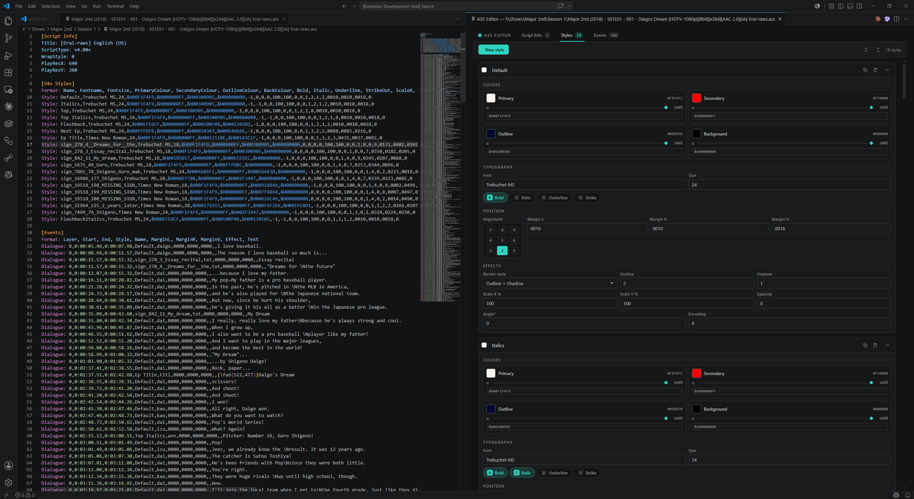
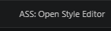
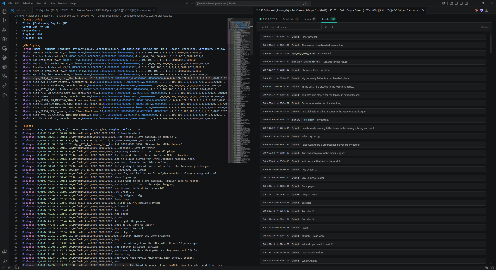
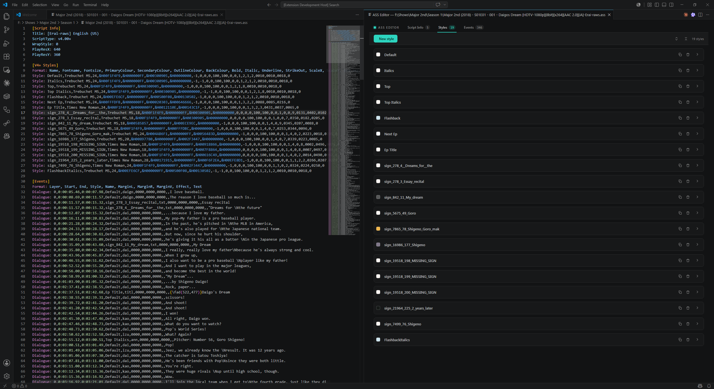
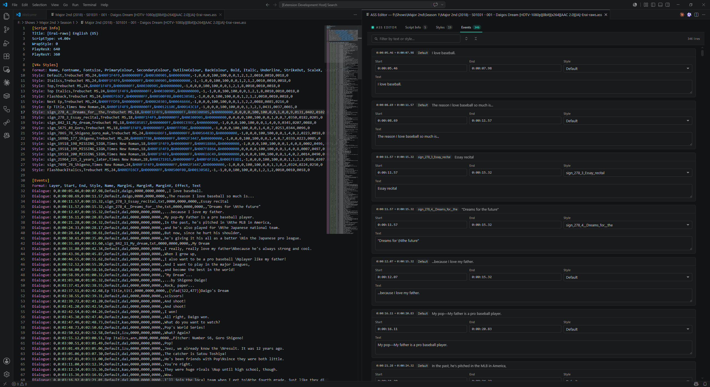

# ASS Subtitle Editor (VS Code)

Decode and edit Advanced SubStation Alpha (`.ass`) subtitle files.



## Features

- **Syntax highlighting** for the whole file — sections, Style/Dialogue/Format lines, override tags, timestamps, and `&H` colors.
- **ASS: Open Style Editor** — opens a decoded, editable panel beside the document:
  - **Styles** — every field editable; colors via picker + hex + alpha slider with the raw `&HAABBGGRR` code always visible; numpad alignment; add / duplicate / delete.
  - **Script Info** — editable key/value rows for header metadata and play resolution.
  - **Events** — searchable list; edit Start / End / Style / Text; override tags shown decoded.
- **Two-way sync** — edits in the panel write back to the document (save with Ctrl+S); edits in the text editor refresh the panel.
- **Lenient parsing** — malformed rows are flagged, never corrupted. Byte-exact round-trip for valid files.

## Screenshots

**Syntax highlighting** — a real `.ass` file, with sections, override tags, timestamps, and `&H` colors highlighted:



**Styles** — the same style card scrolled to fonts, margins, the numpad alignment grid, and effects:



**Events** — every dialogue line in a searchable list, with override tags decoded into chips:



**Script Info** — header metadata and play resolution as editable rows:



## Install

### From a release (easiest)

1. Download `ass-style-editor-<version>.vsix` from this repo's **Releases** page.
2. Install it in VS Code either way:
   - Command Palette (`Ctrl/Cmd+Shift+P`) → **Extensions: Install from VSIX…** → pick the file, or
   - run `code --install-extension ass-style-editor-<version>.vsix`.
3. Open any `.ass` file and run **ASS: Open Style Editor** from the Command Palette or the editor title bar.

### Build from source

Requires Node.js.

```sh
git clone https://github.com/ach-raf/ass-subtitle-editor.git && cd ass-subtitle-editor
npm install
npm run package      # produces ass-style-editor-<version>.vsix
```

Then install the generated `.vsix` as above.

## Develop

- `npm install`
- `npm run compile` — typecheck + bundle (esbuild).
- `npm test` — unit tests (pure parser/color/edit logic).
- Press **F5** to launch an Extension Development Host for manual testing.

## Limits (v1)

UTF-8 only (BOM preserved). No structured override-tag editor, karaoke editor, or video preview.

## License

[MIT](LICENSE) — free and open source.
